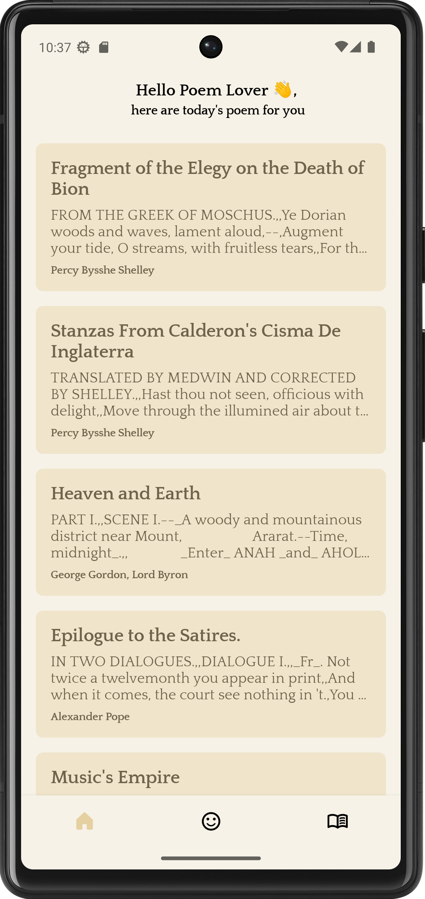
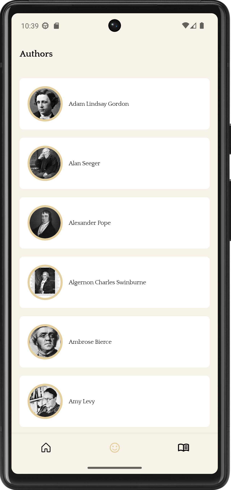
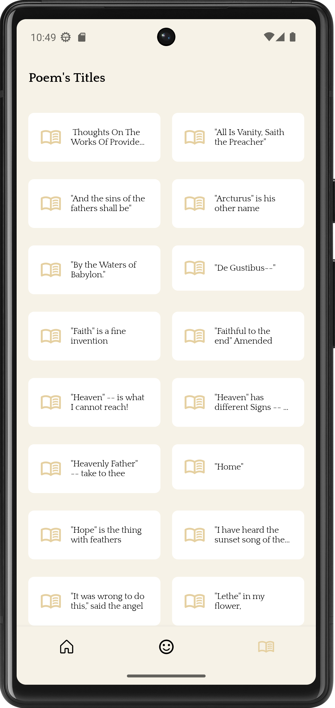
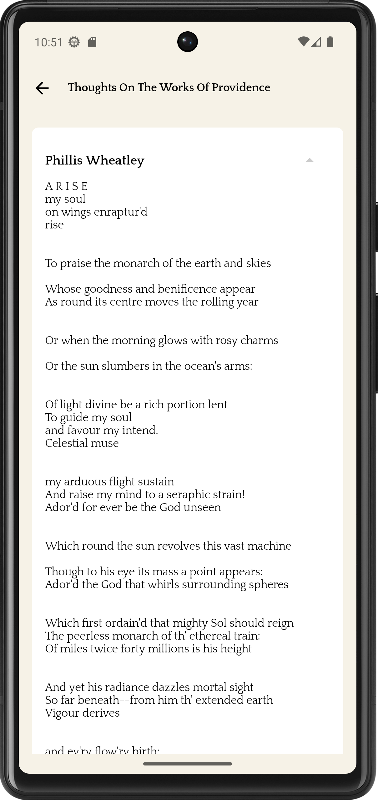
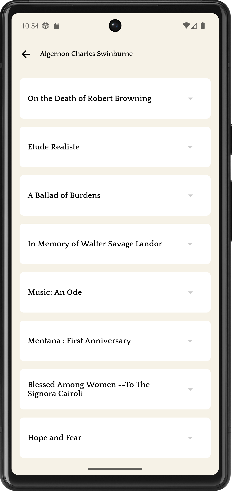
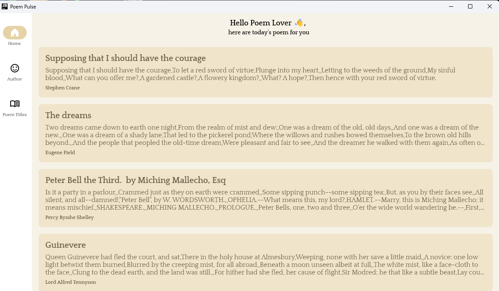
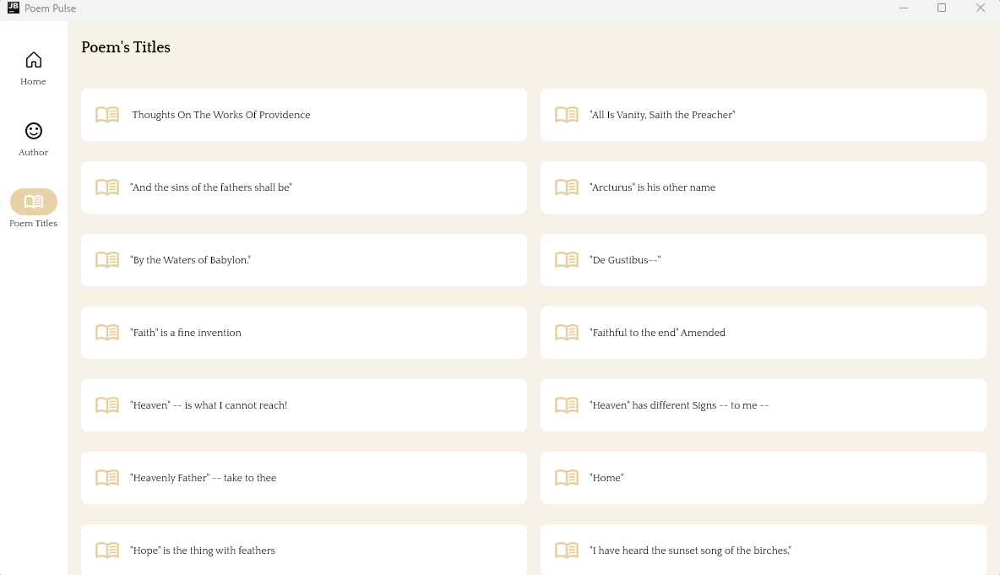

<p align="center"></p>

# PoemPulse
PoemPulse is a captivating Kotlin Multiplatform application designed for poetry enthusiasts. It delivers a fresh, random poem every day, along with a diverse array of poem titles from numerous renowned authors. Dive into the world of poetry with PoemPulse and discover new favorites daily!

## 🛠️ WIP 🛠️
> If you find any bugs or have any suggestions, feel free to open an issue or a pull request.

## Platforms
 |  |  | 
:----: | :----: | :----: | :----:
✅ | Planned | ✅ | Planned

## Screenshots
### Android
     

### Desktop




## Architecture
The app is shared between Android, iOS and Desktop. The shared code is written in Kotlin and the UI is built with Compose Multiplatform. Shared code, written in Kotlin, is compiled to JVM bytecode for Android and Desktop with Kotlin/JVM and to native binaries for iOS with Kotlin/Native.
### Modules
- shared:
   - contains all the shared code between the platforms
- android:
   - contains the android app
- ios:
   - contains the ios app
- desktop:
   - contains the desktop app

## Built with
- [Kotlin Multiplatform](https://kotlinlang.org/docs/multiplatform.html) - The Kotlin Multiplatform technology is designed to simplify the development of cross-platform projects.
- [Compose Multiplatform](https://www.jetbrains.com/lp/compose-multiplatform/) -  a modern UI framework for Kotlin that makes building performant and beautiful user interfaces easy and enjoyable.
- [SQLDelight](https://github.com/cashapp/sqldelight) - SQLDelight is an open-source library developed by Cash App (formerly Square, Inc.) for working with SQL databases in Kotlin-based Android and multi-platform applications.
- [Multiplatform Settings](https://github.com/russhwolf/multiplatform-settings) - A Kotlin Multiplatform library for saving simple key-value data.
- [Koin](https://insert-koin.io/) - The pragmatic Kotlin & Kotlin Multiplatform Dependency Injection framework.
- [Voyager](https://voyager.adriel.cafe/) - A multiplatform navigation library.
- [Ktor](https://ktor.io/docs/client-create-multiplatform-application.html)- Ktor is a framework for building asynchronous server-side and client-side application with ease.
- [Kotlinx-serilization](https://github.com/Kotlin/kotlinx.serialization) - Kotlin multiplatform / multi-format serialization.
- [Compose Components Resources](https://mvnrepository.com/artifact/org.jetbrains.compose.components/components-resources) - Resources For Compose Multiplatform.
- [Material3 Window Size Multiplatform](https://github.com/chrisbanes/material3-windowsizeclass-multiplatform) - About Material 3 Window Size Class for Compose Multiplatform.
- [Spotless](https://github.com/diffplug/spotless) - A code formatter that helps keep the codebase clean.
- [Kottie](https://github.com/ismai117/kottie) - Compose Multiplatform animation library that parses Adobe After Effects animations.

## Run project
### Android
To run the application on android device/emulator:
- open project in Android Studio and run imported android run configuration

### Desktop
Run the desktop application: `./gradlew :desktopApp:run`

## License
```xml
Copyright 2024 Brandy Odhiambo

    Licensed under the Apache License, Version 2.0 (the "License");
    you may not use this file except in compliance with the License.
    You may obtain a copy of the License at

    http://www.apache.org/licenses/LICENSE-2.0

    Unless required by applicable law or agreed to in writing, software
    distributed under the License is distributed on an "AS IS" BASIS,
    WITHOUT WARRANTIES OR CONDITIONS OF ANY KIND, either express or implied.
    See the License for the specific language governing permissions and
    limitations under the License.
```  
  
